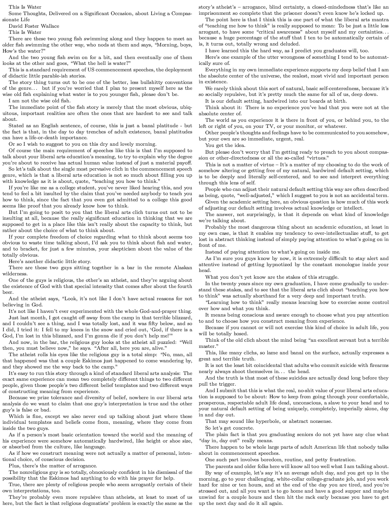

# printable
## Usage
In the same folder as the script type 
```shell 
bash script.sh some_book.epub
```

## Dependencies
* ebook-convert (from calibre)
* pandoc
* pdflatex

# Note
The script now converts line returns into semicolon so that it's now even more dense

## Example output

